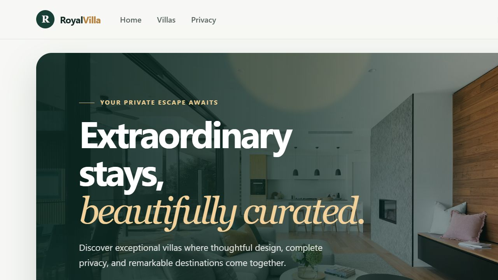
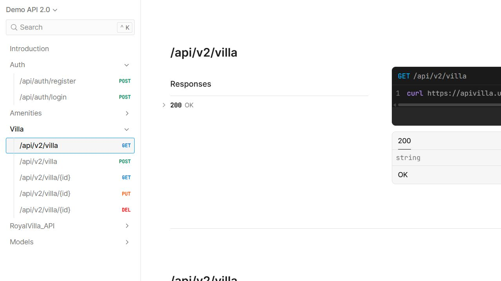
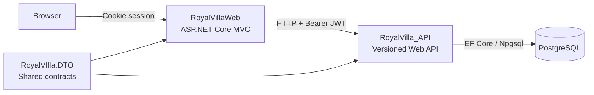

# RoyalVilla

RoyalVilla is an educational, end-to-end .NET project centered on designing, documenting, consuming, and deploying a versioned ASP.NET Core Web API. The repository includes a REST API, a server-rendered MVC client, shared DTO contracts, PostgreSQL persistence, authentication, API documentation, and containerized deployment.

[](https://dotnet.microsoft.com/)
[](https://www.postgresql.org/)
[](https://www.docker.com/)

[Open in GitHub Codespaces](https://codespaces.new/UrosVel97/RoyalVilla?quickstart=1)

## Live demo

| Experience | URL |
| --- | --- |
| MVC web application | [villa.urosvelickovic.dev](https://villa.urosvelickovic.dev/) |
| Scalar API reference | [apivilla.urosvelickovic.dev/scalar](https://apivilla.urosvelickovic.dev/scalar/#demo-api-20) |
| Source code | [github.com/UrosVel97/RoyalVilla](https://github.com/UrosVel97/RoyalVilla) |

### MVC client



### API reference



## What the repository demonstrates

- Versioned ASP.NET Core REST endpoints for villas and amenities
- Entity Framework Core with PostgreSQL, migrations, relationships, and seed data
- Shared request and response DTOs with a consistent `ApiResponse<T>` envelope
- JWT issuance and role claims in the API
- Cookie authentication in MVC with JWT forwarding to backend API requests
- Role-based protection for villa management operations
- OpenAPI documents and interactive Scalar API documentation
- Multi-stage Docker builds, Compose networking, health checks, and persistent volumes
- A disposable GitHub Codespaces development environment
- Deployment to a self-managed VPS through Dokploy and HTTPS reverse proxies

## Architecture



| Project | Responsibility |
| --- | --- |
| `RoyalVilla_API` | Versioned REST endpoints, JWT authentication, authorization, AutoMapper, EF Core, migrations, OpenAPI, and health checks |
| `RoyalVillaWeb` | MVC controllers, Razor views, cookie authentication, session-backed JWT storage, and API consumption through `HttpClientFactory` |
| `RoyalVIlla.DTO` | Shared villa, amenity, authentication, user, and response contracts |

### Typical request flow

1. A Razor page sends a request to an MVC controller.
2. The MVC service calls the versioned API through the named `RoyalVillaAPI` HTTP client.
3. When available, the JWT stored in the user's session is attached as a Bearer token.
4. The API authorizes the request and queries PostgreSQL asynchronously through EF Core.
5. AutoMapper converts entities into DTOs wrapped in `ApiResponse<T>`.
6. MVC renders the returned data in a Razor view.

### Authentication and roles

The API returns a seven-day JWT containing the user ID, name, email, and role. The MVC application reads those claims, creates its own authentication cookie, stores the original JWT in session, and forwards that token on later API calls.

- `Customer` and `Admin` users can access the authenticated villa list.
- Villa create, update, and delete operations require the `Admin` role in both MVC and the API.
- An authenticated non-admin user is redirected to the MVC access-denied page.

## Technology stack

| Area | Technology |
| --- | --- |
| Platform | .NET 10, ASP.NET Core Web API, ASP.NET Core MVC, Razor |
| Data | Entity Framework Core, Npgsql, PostgreSQL 17 |
| API | API Versioning, OpenAPI, Scalar, AutoMapper |
| Security | JWT Bearer authentication, cookie authentication, role claims |
| Delivery | Docker, Docker Compose, health checks, Dokploy, VPS |

## API overview

| Method and route | Purpose | Current access |
| --- | --- | --- |
| `POST /api/auth/register` | Register a user | Public |
| `POST /api/auth/login` | Return a JWT and user details | Public |
| `GET /api/v1/villa` | List villas | `Customer` or `Admin` |
| `GET /api/v1/villa/{id}` | Get one villa | Public |
| `POST /api/v1/villa` | Create a villa | `Admin` |
| `PUT /api/v1/villa/{id}` | Update a villa | `Admin` |
| `DELETE /api/v1/villa/{id}` | Delete a villa | `Admin` |
| `/api/v1/amenities` | Amenity CRUD operations | Public in the current educational implementation |

URL-based API versioning generates separate OpenAPI documents. The v1 villa API contains the working implementation; the v2 villa GET behavior is currently a versioning demonstration and is listed under educational scope below.

Successful and failed API operations use a common response envelope:

```json
{
    "success": true,
    "statusCode": 200,
    "message": "Villas retrieved successfully",
    "data": [],
    "errors": null,
    "timestamp": "2026-08-08T12:00:00Z"
}
```

## Repository layout

```text
RoyalVilla/
├── RoyalVilla_API/          # REST API, EF Core models, migrations, auth
├── RoyalVillaWeb/           # MVC client, Razor views, static assets
├── RoyalVIlla.DTO/          # Shared API contracts
├── .devcontainer/           # GitHub Codespaces configuration
├── compose.yaml             # Local PostgreSQL service
├── compose.production.yaml  # Complete production-style stack
├── Dockerfile               # Multi-stage API and MVC images
└── RoyalVilla.slnx          # .NET solution
```

## Run locally

### Prerequisites

- [.NET 10 SDK](https://dotnet.microsoft.com/download/dotnet/10.0)
- [Docker Desktop](https://www.docker.com/products/docker-desktop/) or Docker Engine with Compose
- Git
- A trusted ASP.NET Core development certificate for local HTTPS

Trust the development certificate once:

```bash
dotnet dev-certs https --trust
```

### 1. Clone and configure

```bash
git clone https://github.com/UrosVel97/RoyalVilla.git
cd RoyalVilla
cp .env.example .env
```

PowerShell equivalent:

```powershell
git clone https://github.com/UrosVel97/RoyalVilla.git
Set-Location RoyalVilla
Copy-Item .env.example .env
```

Set `POSTGRES_PASSWORD` in `.env` to a local development password. Keep the remaining PostgreSQL defaults unless you also update the connection string below.

### 2. Start PostgreSQL

```bash
docker compose up -d postgres
docker compose ps
```

PostgreSQL listens only on `127.0.0.1:5432` and stores its data in the `postgres_data` Docker volume.

### 3. Restore and build

```bash
dotnet tool restore
dotnet restore RoyalVilla.slnx
dotnet build RoyalVilla.slnx --no-restore
```

### 4. Start the API

Use the same password that you placed in `.env`.

PowerShell:

```powershell
$env:ConnectionStrings__DefaultConnection = "Host=localhost;Port=5432;Database=royalvilla;Username=royalvilla;Password=<your-password>"
dotnet run --project RoyalVilla_API --launch-profile https --no-build
```

Bash:

```bash
export ConnectionStrings__DefaultConnection='Host=localhost;Port=5432;Database=royalvilla;Username=royalvilla;Password=<your-password>'
dotnet run --project RoyalVilla_API --launch-profile https --no-build
```

The API applies pending EF Core migrations during startup.

### 5. Start the MVC client

Open a second terminal:

```bash
dotnet run --project RoyalVillaWeb --launch-profile https --no-build
```

Local URLs:

| Service | URL |
| --- | --- |
| MVC application | `https://localhost:7271` |
| Project case study | `https://localhost:7271/Home/Project` |
| Scalar API reference | `https://localhost:5050/scalar` |
| Web health check | `http://localhost:5079/health` |
| API health check | `http://localhost:5000/health` |

Stop the API and web processes with `Ctrl+C`. Stop PostgreSQL without deleting its data:

```bash
docker compose down
```

To reset the local database completely, remove the volume as well:

```bash
docker compose down --volumes
```

## Run in GitHub Codespaces

The repository includes a complete dev-container configuration. No local .NET or PostgreSQL installation is required.

1. Open the repository on GitHub.
2. Select **Code** → **Codespaces** → **Create codespace**. Select the branch you want to run before creating it.
3. Wait for the dev container to finish its startup checks.

The container automatically:

1. Starts PostgreSQL in a sibling container.
2. Restores .NET tools and NuGet packages.
3. Builds the complete solution.
4. Starts the API on port `5000`.
5. Applies pending EF Core migrations.
6. Starts the MVC application on port `5079`.

Open the **Ports** panel in VS Code after startup:

- Port `5079` is labeled **RoyalVilla Web** and is configured for public forwarding.
- Port `5000` is labeled **RoyalVilla API** and remains private by default.
- If organization policy makes port `5079` private, right-click it and change **Port Visibility** to **Public** before sharing it.

Codespaces logs are available inside the app container:

```bash
tail -f '/tmp/royalvilla/RoyalVilla Web.log'
tail -f '/tmp/royalvilla/RoyalVilla API.log'
```

The database credentials in `.devcontainer/compose.yaml` are disposable demo credentials and must not be reused in deployment.

## Run the complete stack with Docker

This path builds and runs the MVC application, API, and PostgreSQL together using the production-style Compose file.

1. Copy `.env.example` to `.env`.
2. Set a strong `POSTGRES_PASSWORD`.
3. Set `JWT_SECRET` to an independent secret containing at least 32 bytes.
4. Start the stack:

```bash
docker compose -f compose.production.yaml up -d --build
docker compose -f compose.production.yaml ps
```

The default endpoints are:

- MVC application: `http://127.0.0.1:8080`
- API and Scalar: `http://localhost:5000/scalar`

View logs or stop the stack:

```bash
docker compose -f compose.production.yaml logs -f web api postgres
docker compose -f compose.production.yaml down
```


## Health checks and database migrations

Both executable projects expose `/health`. Docker uses those endpoints to coordinate service startup. The API calls `Database.MigrateAsync()` during startup, so the configured database user needs permission to create and alter the schema.

Five example villas are seeded by the initial EF Core migration. PostgreSQL data persists across normal container restarts.

## Educational scope

RoyalVilla is a Web API learning and portfolio project, not a production booking platform. The following hardening work is intentionally visible in the repository:

- Replace plain-text password storage with `PasswordHasher<TUser>` or BCrypt.
- Force public registration to assign the `Customer` role rather than accepting a role from the request.
- Complete the v2 GET behavior or temporarily remove the unfinished API version.
- Add unit and integration tests for authentication and villa CRUD operations.

Do not use real credentials or personal data with this demo.

## Deployment

The live application uses multi-stage .NET images, PostgreSQL, Docker Compose, health checks, persistent volumes, Dokploy, and HTTPS domains on a self-managed VPS. Production secrets are supplied through environment variables and are not stored in the repository.

### Automatic deployment from GitHub

The [Deploy to Dokploy workflow](.github/workflows/deploy.yml) triggers a production deployment after every push to `master`. It can also be started manually from the repository's **Actions** tab.

Configure it once in GitHub:

1. Regenerate the webhook in Dokploy if its URL has ever been exposed.
2. Open the GitHub repository and go to **Settings** → **Secrets and variables** → **Actions**.
3. Create a repository secret named `DOKPLOY_WEBHOOK_URL` whose value is the complete Dokploy Compose webhook URL.
4. Ensure the Dokploy application is configured to deploy the `master` branch.
5. Merge or push a change to `master`, then monitor **Actions** → **Deploy to Dokploy**.

The workflow does not print the webhook URL or store it in this repository. GitHub masks the secret in workflow logs. The deployment job fails if the secret is missing or Dokploy returns an unsuccessful HTTP status.

